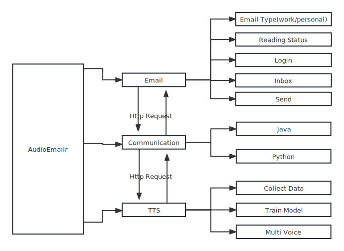
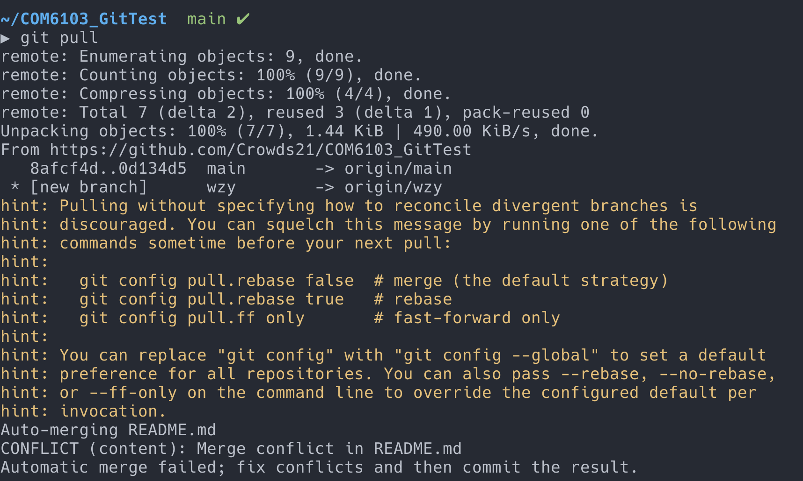
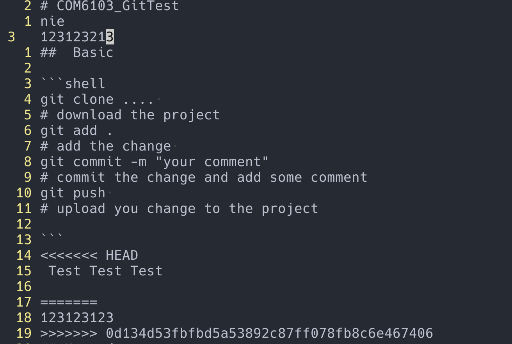
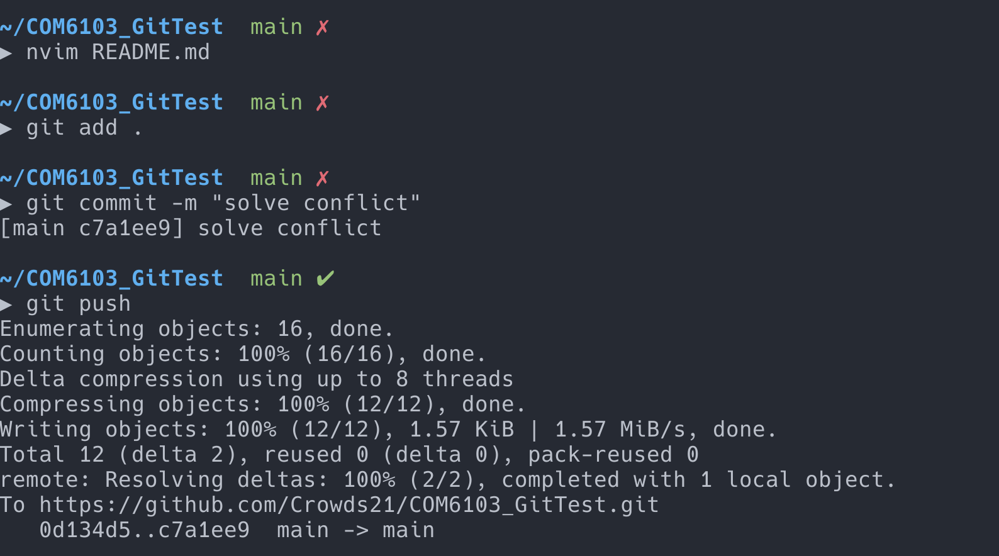
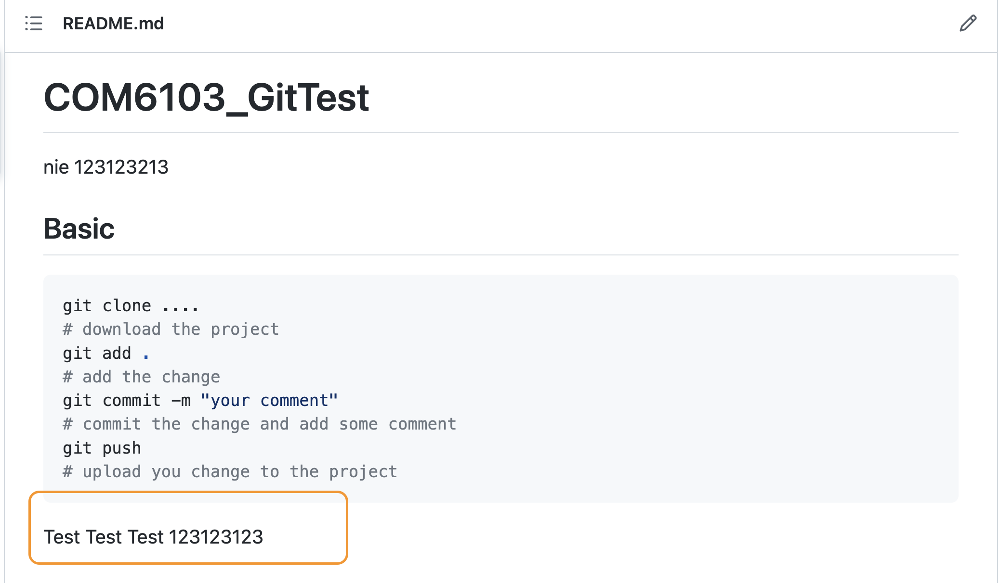

# Week3-Thu-meeting

# Agenda

* Questions of last meeting(on Tuesday)
* Module/Function division
* Document job
* What should to do in this stage

  * TTS Part
  * Email Part
* Trello
* Git

# Questions

* The report should contain evidences of the meetings
* What is peer programming
* Does the advisor say that if we are considering using google docs to save documents then the link needs to be provided to them?
* Personal or business email

## Module/Function division

​​

If you have any comments, I can make adjustments to him. 

# Document 

What documentation needs to be prepared during the project?

# What should to do in this stage

Is there anything else you think needs to be changed. And assigning tasks.

## TTS

* Use python to send and receive http request, and send voice(demo)
* Research on training text-to-speech model

  * How  to collect data
  * .....
* Alternate Plans (If anyone is interested)

  * How to use Microsoft  api, and the fee Policy

## Email 

* Email Part

  * Demo of send and receive gmail
  * The general style of the front end

# Trello 

How to manage development progress with Trello.

# Git

* Command Line
* GUI
* IDE

## Command Line

* Git

  * One person/module , one branch(different version of the project),

    * On week 5, Ziyu will manually merge them into one branch.
    * ```shell
      # Create and switch branches
      git checkout -b mq
      # It is a combination of the following two commands
      git branch mq
      git checkout mq
      ```
  * Clone the code, change it and commit it

    * ```shell
      git clone  <url>
      # download the project

      git add .
      # add the change in current folders

      git commit -m "your comment"
      # commit the change and add some comment

      git pull
      # Pull other people's updates to local, to know whether the local code conflict with the cloud code
      # If your code have confict with the code in gitlab, you need to handle them manually
      # Then you should do the following action again
      # git add .
      # git commit -m "your comment"
      git push 
      # upload you change to the project
      ```
    * After running `git pull`​ , you will see the following prompt in git if a conflict arises.

      * ​`CONFLICT(content): Merge conlict in README.md`​
      * ​​
      * In this example, open `REAME.md`​, you can see 

        * ​​
        * ```md
          <<<<<<< HEAD
           Test Test Test

          =======
          123123123
          >>>>>>> 0d134d53fbfbd5a53892c87ff078fb8c6e467406
          ```
        * And you need to decide what content to keep and what to delete. In this case, I keep all of them 

          * ```md
            Test Test Test
            12312312
            ```
          * ​​
          * ​​

## GUI and  IDEA

Both Pycharm and Intellij have Git integration, so the overall process is similar to the one described above, and with a graphical interface, it's much easier to use.

Or you can use [GitHub Desktop](https://desktop.github.com/)

‍
