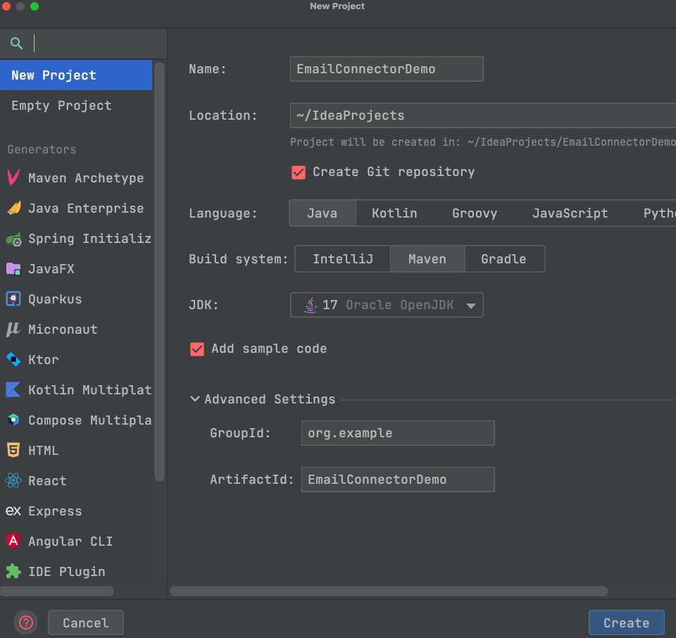
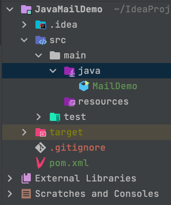

# Java Mail Demo (Attachment & HTML)

 `/demo/**.java` for code details

## Resources

* [JavaMail API Tutorial (tutorialspoint.com)](https://www.tutorialspoint.com/javamail_api/index.htm)
* [Sending an Email using the JavaMail API (oracle.com)](https://www.oracle.com/webfolder/technetwork/tutorials/obe/java/javamail/javamail.html)
* [JavaMail API - Sending Email With Attachment (tutorialspoint.com)](https://www.tutorialspoint.com/javamail_api/javamail_api_send_email_with_attachment.htm)
* [3 Examples of Parsing HTML File in Java using Jsoup](https://javarevisited.blogspot.com/2014/09/how-to-parse-html-file-in-java-jsoup-example.html#axzz7uzMHjEgs)
  * [jsoup](https://jsoup.org/)

* [Reading entire html file to String?(stuckoverflow.com)](https://stackoverflow.com/questions/12035316/reading-entire-html-file-to-string)


## Create Project

If you are not using Intellij, please go to [IntelliJ IDEA ](https://www.jetbrains.com/idea/) and download it. Free trial available via student email.



Create new project, nad use `Maven`​ as the build system. Maven is a software project management and understanding tool. One of its uses is to help us download Java libraries.

After you create the project, `pom.xml`​ is the configuration file of maven,Add the following code to it (`<dependencies> ... </dependencies>`​ , to download Javamail.

API document of Javamail: [Overview (JavaMail API documentation) (javaee.github.io)](https://javaee.github.io/javamail/docs/api/)

```xml
....
    </properties>

    <dependencies>
        <dependency>
            <groupId>com.sun.mail</groupId>
            <artifactId>javax.mail</artifactId>
            <version>1.6.2</version>
        </dependency>
    </dependencies>
....
</project>
```

Click on the icon in the upper right corner (as shown below) after the changes are made , then maven will start downloading the `dependency`​ we added

 ​

Then create a `MailDemo`​ Java file



## Configuration in gmail

### Turn on IMAP

Before you can start writing the code, you need to enable IMAP (the protocol used to receive emails) in your google mail account

In Gamil's settings, select `See all settings`​, then select `Forwarding and POP/IMAP`​. On this page, select `Enable IMAP`​.

### Get an App password

Click on your avatar in the upper right corner, select `Manage your google account`​, then select `Security`​, turn on `2-step verification`​.

Once you have successfully enabled it, go back to the `Security`​ page and you can see the `App password`​ under `2-step verification`​. Go to the app passowrd page , select `Mail`​ and `Windows Computer`​.

This password is used to send emails via SMTP.

## Send Email

Here is a brief overview of some of the objects/concepts that are present in the code.

#### Set Property

Different mailboxes need to set different `mail.smtp.host`​​, for example Gmail: [Check Gmail through other email platforms - Gmail Help (google.com)](https://support.google.com/mail/answer/7126229?authuser=1&visit_id=638127841218345285-1931152463&hl=en-GB&rd=1#zippy=%2Cstep-change-smtp-other-settings-in-your-email-client)

#### java.util.Properties. 

Simple explanation: store key-value pairs,  and can be used for both input and output streams

#### javax.mail.Session

In the JavaMail API, javax.mail.Session is a class that represents a mail session. It is an abstract class that represents communication with the mail server and provides various configuration information needed for operations such as connecting to the mail server, sending and receiving emails

#### Message.RecipientType.TO

In JavaMail API, Message.RecipientType.TO represents the recipient type of a mail message. It is an enumeration constant used to specify that the recipient of the message is a direct primary recipient, i.e., the main recipient of the message.

Here are some common recipient types:

* TO: primary recipient (can be multiple)
* CC: carbon copy recipient (can be multiple)
* BCC: blind carbon copy recipient (can be multiple, but not displayed in the email header)

When sending an email message using JavaMail API, you can use one of these recipient types to specify the recipients of your email message.

#### Anonymous inner classes

It feels like when you take an object as a parameter, you also need to use a function in the object, so we need to define the function while creating the object.


## Send Html Content

This section describes how to send html as the body of a mailbox.

A very simple way (which is recommended) to do this is to use `message.setText`

```java
message.setText("<html><body><h1>This is an HTML message.</h1></body></html>", "UTF-8", "html");
// Or
message.setContent(htmlText, "text/html");
```

Another way is to use the `MimeBodyPart`

```java
// Demo code, not able to run directly
private MimeMultipart setHtmlContent(String htmlContent, MimeMultipart multipart){
  var emailContent = new MimeBodyPart();
  emailContent.setContent(htmlContent, "text/html");
  emailContent.setDisposition(MimeBodyPart.INLINE);
  multipart.addBodyPart(emailContent);
  return multipart;
}
MimeMessage message = new MimeMessage(session);

// Omit other content

Multipart multipart = new MimeMultipart();
multipart = setHtmlContent("HtmlString", multipart);
message.setContent(multipart);
Transport.send(message);
```

In addition to `text/html`, `MimeBodyPart` can set a variety of `MIME` types. The following are some of the common MIME types that can be set by MimeBodyPart.

- `text/plain`: Content in plain text format.
- `text/xml`: Content in XML format.
- `application/json`: Content in JSON format.
- `image/jpeg`: Image in JPEG format.
- `image/png`: image in PNG format.
- `audio/mpeg`: Audio in MP3 format.
- `video/mp4`: video in MP4 format.
- `application/pdf`: document in PDF format.

### Convert HTML File to String

Add Jsoup dependency to your `pom.xml` 

```xml
        <dependency>
            <groupId>org.jsoup</groupId>
            <artifactId>jsoup</artifactId>
            <version>1.13.1</version>
        </dependency>
}
```

The following code converts the HTML file to String and return it.

```java
public static String convertHTMLMessagetoString(){
        String string = null;
        try {
            Document doc = Jsoup.parse(new File("your HTML file path"),"ISO-8859-1");
            string = doc.text();
        } catch (IOException e) {
            e.printStackTrace();
        }
        return string;
    }
}
```


## Send Email with Attachment

```java
private static MimeMultipart setAttachment(String filePath, MimeMultipart multipart) {
  var emailAttachment = new MimeBodyPart();
  DataSource source = new FileDataSource(filePath);
  emailAttachment.setDataHandler(new DataHandler(source));
  // Even if this parameter is not set, the attachment will be sent by default
  emailAttachment.setDisposition(MimeBodyPart.ATTACHMENT);
  emailAttachment.setFileName(filePath);
  multipart.addBodyPart(emailAttachment);
  return multipart;
}

MimeMessage message = new MimeMessage(session);

// Omit other content

Multipart multipart = new MimeMultipart();
multipart = setHtmlContent("HtmlString", multipart);
message.setContent(multipart);
Transport.send(message);
```

All you need to do is read a local file by  `DataSource` and add it to the `mimeBodyPart` using the `DataHandler`


## Receive Email

Modify the `main`​ method

```java
public static void main(String[] args) {
    //sendMail();
    receiveMail();
}
```


The following part is a brief overview of some of the objects/concepts that are present in the code.

### Store

When using JavaMail to retrieve email messages, you typically create a Session object and configure it with the necessary properties, such as the mail server host, port, and protocol. You can then use the Session object to create a Store object, which represents the message store you want to access. Once you have a Store object, you can use it to open a folder, retrieve messages from the folder, and perform other operations on the folder and its contents.

### Folder

In JavaMail, the Folder class represents a mail folder in a mail server. The Store class provides access to mailboxes on a mail server, and allows you to manipulate the folders and messages within those mailboxes.

In the line Folder folder = store.getFolder("INBOX");, the getFolder() method of the Store class is called to retrieve the Folder object for the INBOX mailbox on the connected mail server. The INBOX is the default mailbox where incoming mail is typically stored.

Once you have obtained a Folder object, you can use its methods to read and manipulate the messages in that folder, such as retrieving a list of messages, marking messages as read or deleted, or moving messages to other folders.

### Message

folder.getMessages() returns an array of Message objects, which represents the email messages in the selected folder. Each Message object corresponds to a single email message in the folder, and contains various attributes of the message such as sender, recipients, subject, body, attachments, and so on.

The getMessages() method retrieves all the messages in the folder and returns them as an array of Message objects. Once you have the Message objects, you can process them as needed, such as displaying their contents, saving them to a file, or deleting them from the server.

### Close the connection

folder.close(true) method call closes the folder and expunges any messages marked for deletion. If the parameter is set to true, any messages marked for deletion will also be permanently deleted from the server. Otherwise, they will be marked as deleted and expunged the next time the folder is opened with Folder.open(Folder.READ_WRITE) or Folder.expunge() is called.

The store.close() method closes the store associated with the current folder. It also terminates any network connections that the store might be using.

### PrintMessage

```java
public static void printMessage(MimeMessage msg) 
    throws MessagingException, UnsupportedEncodingException {
        System.out.println("Subject: " 
                + MimeUtility.decodeText(msg.getSubject()));

        Address[] froms = msg.getFrom();
        // Get the sender's address
        InternetAddress address = (InternetAddress) froms[0];
        // Assuming that there is only one sender,
        // So we just get the first element of froms
        // In fact, I don't understand 
        //    how there can be multiple senders
    
        String personal = address.getPersonal();
        // Name of the sender, return null if can not get the send's name
    
        String from = personal == null 
                ? address.getAddress() 
                : (MimeUtility.decodeText(personal) + 
                " <" + address.getAddress() + ">");
    
        System.out.println("From: " + from);
    }
```


### MimeUtility.decodeText

The emails may contain some non-ACSII characters, which will be encoded in other ways when sent, so they need to be decoded when received.

### a ? b : c

If a is true , the output is b, otherwise c

‍
